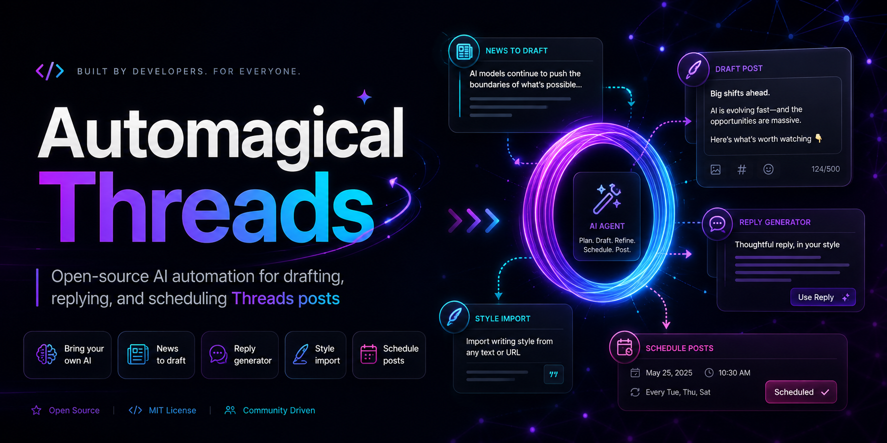
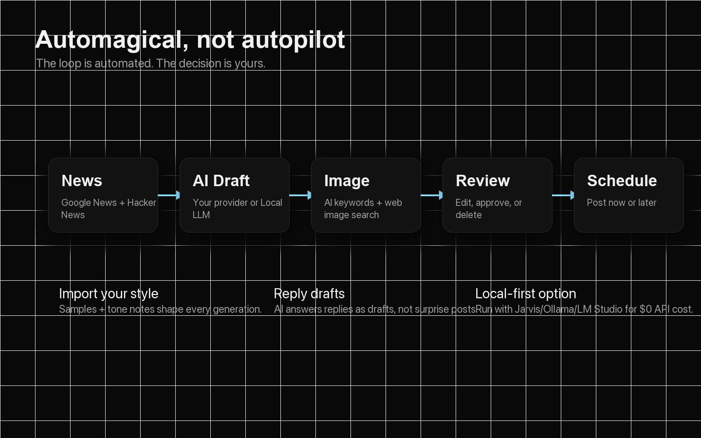
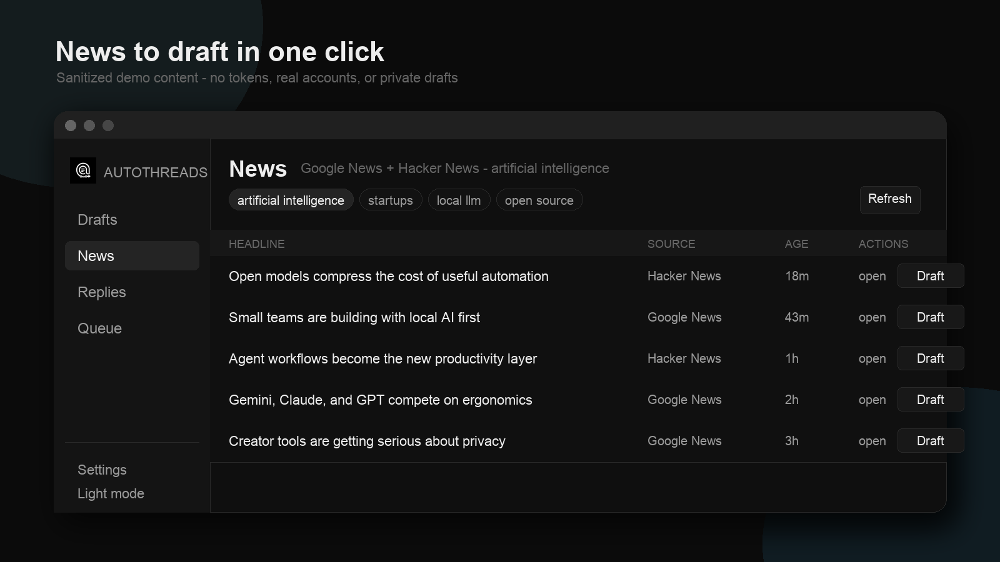
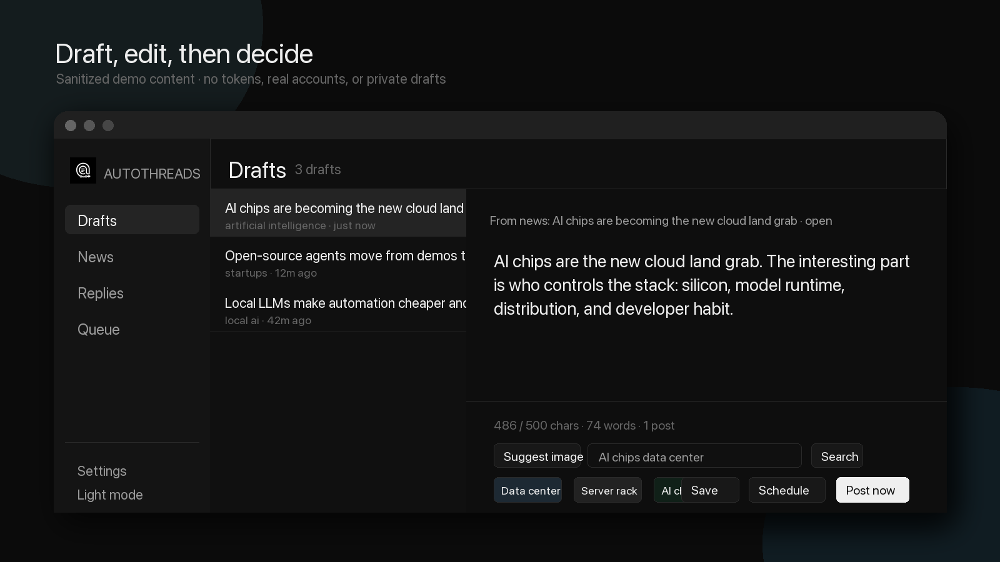
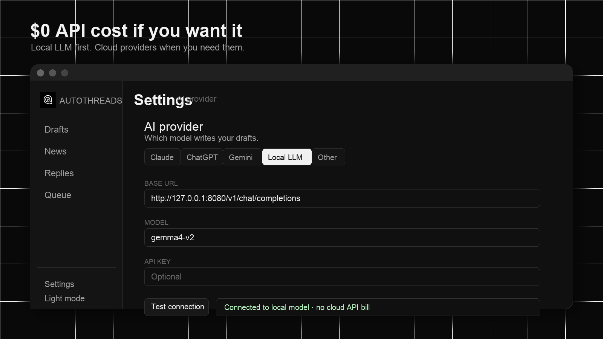
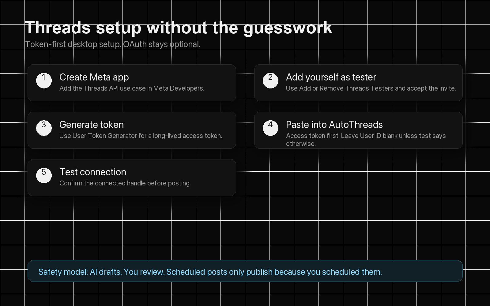

<div align="center">



# AutoThreads

### Automate Threads with AI. **You** stay in control.

Automagical Threads automation for creators, founders, builders, and people who want a sharper posting workflow without handing the wheel to a bot.

[](https://github.com/eisenjimmy/autoTHREADS/actions/workflows/ci.yml)


**English** · [한국어](#한국어)

</div>

---

## The Idea

AutoThreads is a desktop app that helps you turn news, replies, and ideas into Threads drafts.

The important part: **AI writes drafts. You decide what posts.**

It is built for a creator workflow where you want leverage, not chaos:

- Find news around topics you care about.
- Let AI summarize it into a Thread-ready draft.
- Pull a related image from the web.
- Import your own writing style.
- Draft replies with AI.
- Schedule posts for later.
- Use a local LLM for **$0 cloud API cost**, or bring Claude, ChatGPT, Gemini, or any OpenAI-compatible endpoint.



## Screenshots







> Screenshots use sanitized demo content. No real tokens, accounts, drafts, or private data are shown.

## What It Does

| Feature | What it means |
| --- | --- |
| **News/blogs to drafts** | Pick your topics or use presets like science, fashion, lifestyle, finance, travel, and food. Browse Google News RSS, blog-oriented searches, and selective Hacker News for tech topics. |
| **Local LLM support** | Run with Jarvis, Ollama, LM Studio, llama.cpp, or another OpenAI-compatible local server for **$0 API cost**. |
| **Cloud model support** | Use Claude, ChatGPT/OpenAI, Gemini, or a custom OpenAI-compatible provider. |
| **Image assist** | AI suggests image keywords, AutoThreads searches Wikimedia Commons, and you choose an optional public image. |
| **Your writing style** | Add style notes, paste sample posts, or import recent Threads posts to teach the assistant your voice. |
| **Reply drafts** | Pull unanswered replies and generate response drafts. You still review before posting. |
| **Scheduler** | Schedule approved drafts for later. Scheduled posts publish automatically while the app is open. |
| **Token-first Threads setup** | Paste a Threads access token. OAuth app credentials are optional advanced setup. |
| **Private by design** | Secrets are encrypted with the OS keychain. The renderer does not get direct filesystem/network access. |
| **Localized UI** | English, Spanish, Korean, Chinese, Japanese, French, German, and Portuguese for core workflows. |

## Quick Start

```bash
git clone https://github.com/eisenjimmy/autoTHREADS.git
cd autoTHREADS
npm install
npm run dev
```

Build the production app:

```bash
npm run build
npm start
```

Package installers:

```bash
npm run package:mac
npm run package:win
npm run package:all
```

## Configure AI

Open **Settings → AI provider**.

### Option A: Local LLM, $0 API Cost

Use any OpenAI-compatible local server.

| Server | Base URL example | Model example |
| --- | --- | --- |
| Jarvis | `http://127.0.0.1:8080/v1/chat/completions` | `gemma4-v2` |
| Ollama | `http://localhost:11434/v1` | `llama3.1` |
| LM Studio | `http://localhost:1234/v1` | whatever model you loaded |

Then click **Test connection**.

### Option B: Hosted AI

Supported providers:

- Claude
- ChatGPT / OpenAI
- Gemini
- Other OpenAI-compatible endpoint with raw JSON request overrides

For **Other**, you can configure:

- Base URL
- Model
- Optional API key
- Headers JSON
- Request JSON such as `temperature`, `top_p`, `max_tokens`, or provider-specific fields

## Configure Threads



Publishing and reply management use the official Threads API. The easiest desktop workflow is token-first.

### Step-by-step

1. Go to [Meta Developers](https://developers.facebook.com/) and create/select your app.
2. Add the **Threads API** use case.
3. In the Threads API settings, click **Add or Remove Threads Testers**.
4. Add your Threads account.
5. Accept the tester invite in Threads if Meta asks.
6. Return to **User Token Generator**.
7. Generate a token.
8. Open AutoThreads → **Settings → Threads API**.
9. Paste the token into **Access token**.
10. Leave **User ID** blank unless the test tells you otherwise.
11. Click **Test connection**.

Advanced OAuth setup is still available in the app, but most desktop users do not need App ID, App Secret, or Redirect URI once they have a usable token.

## Daily Workflow

1. Add topics you care about.
2. Open **News** and choose a headline.
3. Click **Generate draft**.
4. Edit the draft.
5. Click **Suggest images** and choose an optional image.
6. Post now, schedule it, or delete it.
7. Use **Replies** to draft responses to unanswered replies.
8. Use **Writing style** settings to keep drafts sounding like you.

## Architecture

```text
News sources ─┐
              ├─> LLM provider ─> Draft ─> Review ─> Post now / Schedule ─> Threads API
Replies API ──┘        │                         │
                       │                         └─> Optional public image
                       └─> Your style notes + samples
```

### Main Process

Electron/Node owns side effects:

- News fetching
- LLM calls
- Image search
- Threads API calls
- Draft persistence
- Scheduler
- Secret encryption

### Renderer

React is a typed UI over a small `contextBridge` API. It does not directly touch the filesystem, shell, or remote APIs.

### Storage

AutoThreads stores app data as local JSON under the OS user-data directory. API keys and Threads tokens are encrypted with Electron `safeStorage`:

- macOS: Keychain-backed encryption
- Windows: DPAPI-backed encryption

## Tech Stack

| Layer | Tech |
| --- | --- |
| Desktop shell | Electron |
| UI | React 19 + TypeScript |
| State | Zustand |
| Build | Vite |
| Packaging | electron-builder |
| Storage | Dependency-free local JSON |
| APIs | Threads Graph API, Google News RSS, Hacker News Algolia API, Wikimedia Commons |

## Project Layout

```text
electron/          Main process
  main.ts          App window, IPC handlers, security hardening
  llm.ts           Claude / OpenAI / Gemini / Local / Other adapters
  threadsApi.ts    Threads Graph API client
  threadsOAuth.ts  Optional OAuth callback flow
  news.ts          Google News RSS, blog-mode searches, selective Hacker News aggregation
  images.ts        AI image keywords + Wikimedia Commons search
  drafts.ts        Draft store
  scheduler.ts     Due-post publisher + auto-draft loop
  settings.ts      Settings + encrypted secrets

src/               Renderer
  components/      Drafts, News, Replies, Queue, Settings, Onboarding
  store/           Zustand app store
  styles/          Monotone desktop UI
  i18n.ts          Localization strings

docs/assets/       README hero, screenshots, and setup graphics
build/             App icons for packaging
```

## Safety Model

AutoThreads is intentionally not a black-box autoposter.

- Drafts wait for review.
- AI replies are drafts, not surprise posts.
- Auto-generated drafts do not publish themselves.
- Scheduled posts publish only because you scheduled them.
- Tokens and keys are encrypted locally.
- External links open in the system browser.
- Navigation is hardened so arbitrary pages cannot inherit the preload bridge.

## Roadmap Ideas

- Multi-account workspaces
- More direct blog/RSS source controls
- Better image-source controls
- Draft thread splitting
- Analytics on posted content
- Packaged notarized macOS releases
- Linux packaging

## Contributing

Pull requests are welcome.

Recommended checks:

```bash
npm run typecheck
npm run build
```

Please keep the core principle intact: **automate the workflow, not the creator’s judgment.**

## License

[MIT](LICENSE)

> Not affiliated with Meta or Threads. “Threads” is a trademark of Meta Platforms, Inc.

---

# 한국어

## AutoThreads란?

AutoThreads는 Threads 운영을 AI로 도와주는 데스크톱 앱입니다.

핵심은 간단합니다.

**AI가 초안을 만들고, 게시 여부는 사용자가 결정합니다.**

뉴스를 찾고, 글 초안을 만들고, 관련 이미지를 고르고, 답글 초안을 만들고, 예약 발행까지 도와줍니다. 하지만 실제 게시 결정권은 항상 사용자에게 있습니다.

## 핵심 가치

- **AI 자동화 + 사용자 통제**
- **Local LLM 사용 시 API 비용 $0**
- **뉴스 기반 초안 생성**
- **관련 이미지 검색**
- **내 글쓰기 스타일 반영**
- **답글 초안 생성**
- **예약 발행**
- **토큰 우선 Threads 설정**
- **로컬 암호화 저장**

## 주요 기능

| 기능 | 설명 |
| --- | --- |
| **뉴스/블로그 기반 초안** | 관심 주제나 science, fashion, lifestyle, finance, travel, food 같은 프리셋을 선택하면 Google News RSS와 블로그형 검색 결과를 가져오고, 기술 주제에는 Hacker News도 선택적으로 포함합니다. |
| **Local LLM 지원** | Jarvis, Ollama, LM Studio, llama.cpp 같은 로컬 OpenAI 호환 서버를 사용할 수 있습니다. API 비용 없이 실행 가능합니다. |
| **Claude / ChatGPT / Gemini 지원** | 클라우드 모델을 선호하면 API 키를 넣고 사용할 수 있습니다. |
| **Other Provider** | OpenAI 호환 커스텀 엔드포인트, 헤더 JSON, 요청 JSON을 설정할 수 있습니다. |
| **관련 이미지 검색** | AI가 이미지 검색 키워드를 만들고, 앱이 웹에서 이미지를 가져옵니다. 사용자가 선택한 이미지만 게시에 포함됩니다. |
| **글쓰기 스타일 학습** | 스타일 메모, 샘플 글, 최근 Threads 글을 가져와서 내 목소리에 맞는 초안을 만듭니다. |
| **답글 초안** | 답하지 않은 댓글을 가져와 AI 답글 초안을 생성합니다. |
| **예약 발행** | 검토한 초안을 원하는 시간에 예약할 수 있습니다. |

## 빠른 시작

```bash
git clone https://github.com/eisenjimmy/autoTHREADS.git
cd autoTHREADS
npm install
npm run dev
```

프로덕션 빌드:

```bash
npm run build
npm start
```

## AI 설정

앱에서 **Settings → AI provider**를 엽니다.

### Local LLM

Local LLM을 쓰면 클라우드 API 비용 없이 사용할 수 있습니다.

| 서버 | Base URL 예시 | 모델 예시 |
| --- | --- | --- |
| Jarvis | `http://127.0.0.1:8080/v1/chat/completions` | `gemma4-v2` |
| Ollama | `http://localhost:11434/v1` | `llama3.1` |
| LM Studio | `http://localhost:1234/v1` | 로드한 모델명 |

설정 후 **Test connection**을 누르면 됩니다.

### 클라우드 모델

지원 모델:

- Claude
- ChatGPT / OpenAI
- Gemini
- Other OpenAI-compatible endpoint

## Threads API 설정

가장 쉬운 방식은 Access Token을 직접 넣는 것입니다.

1. [Meta Developers](https://developers.facebook.com/)에서 앱을 생성하거나 선택합니다.
2. **Threads API** use case를 추가합니다.
3. Threads API 설정에서 **Add or Remove Threads Testers**를 누릅니다.
4. 본인의 Threads 계정을 tester로 추가합니다.
5. Threads에서 초대 수락이 필요하면 수락합니다.
6. **User Token Generator**로 돌아갑니다.
7. 토큰을 생성합니다.
8. AutoThreads → **Settings → Threads API**로 이동합니다.
9. **Access token**에 토큰을 붙여넣습니다.
10. **User ID**는 보통 비워둡니다.
11. **Test connection**을 눌러 연결된 계정을 확인합니다.

OAuth 설정은 고급 옵션으로 남아 있지만, 데스크톱 사용자는 토큰 방식이 가장 간단합니다.

## 사용 흐름

1. 관심 주제를 추가합니다.
2. **News**에서 뉴스를 고릅니다.
3. **Generate draft**를 누릅니다.
4. 초안을 수정합니다.
5. **Suggest images**로 관련 이미지를 찾습니다.
6. 바로 게시하거나 예약하거나 삭제합니다.
7. **Replies**에서 답글 초안을 만듭니다.
8. **Writing style**에 내 스타일을 추가합니다.

## 보안과 통제

- AI는 초안을 만들 뿐, 자동으로 게시하지 않습니다.
- 예약한 글만 예약 시간에 게시됩니다.
- 토큰과 API 키는 OS keychain 기반으로 암호화됩니다.
- 렌더러는 직접 파일시스템이나 외부 API에 접근하지 않습니다.
- 모든 외부 링크는 시스템 브라우저에서 열립니다.

## 라이선스

[MIT](LICENSE)

> Meta 또는 Threads와 공식 관련이 없습니다. “Threads”는 Meta Platforms, Inc.의 상표입니다.
